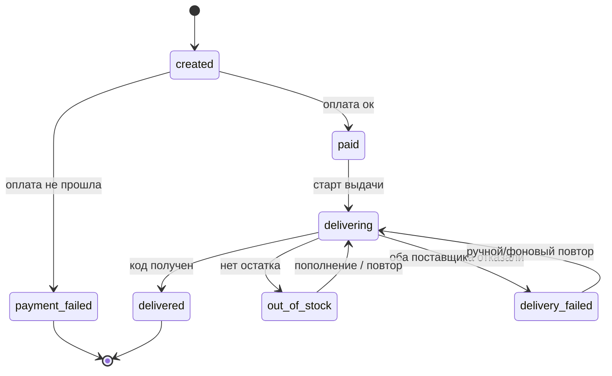

# Тестовое задание: бэкенд-разработчик

Источник: [Google Docs](https://docs.google.com/document/d/11ouRyL-sjW5110I6iRgPG_7WkPaJvUjTZjAE5Ta_OOo/edit?pli=1&tab=t.0)

## Проект

Ядро магазина цифровых товаров для геймеров: платежи, интеграции с поставщиками, каталог, автоматическая доставка товара. Ниша площадок типа GGSel и аналогичных.

## О формате

Задачи построены вокруг однократной выдачи, таймаутов и восстановления — это нельзя скопировать из интернета. В ответе кратко поясните ключевые решения.

## Стек

- Backend: Node.js или PHP приоритетно (рассмотрим Python, Go и другие)
- БД: PostgreSQL или другая реляционная
- REST API, вебхуки, фоновые задачи / очереди — на ваше усмотрение

Оплату эмулируете сами: шлёте вебхук по контракту (тем же скриптом, что и для проверки гонок). Реального эквайринга нет.

## Задание по этапам


### Этап 1. Ядро API (средняя сложность, **обязательно**)

REST: создание заказа по SKU, получение заказа по id, вебхук оплаты. Авто-выдача товара из заглушки-поставщика, корректные переходы статусов, вменяемая схема данных.

### Этап 2. Exactly-once под гонками (сложная, **обязательно**)

Дубли и параллельные вебхуки по одному заказу приводят к выдаче ровно один раз, без потерь. Приложите воспроизводимый тест на параллельность.

### Этап 3. Устойчивые интеграции с ловушкой таймаута (сложная, **сильно желательно**)

Два поставщика-заглушки, случайно падающие и отвечающие с таймаутом. Реализовать таймауты, повторы с бэкоффом и fallback A→B.

Ключевая ловушка: **таймаут ≠ отказ**. Поставщик мог успеть выдать код. Повтор после таймаута не должен привести к двойной выдаче.

### Этап 4. Сверка, наблюдаемость, восстановление (сложная, бонус)

- Структурированные логи по платежам и выдаче
- Эндпоинт / скрипт сверки: «оплачен, но не выдан» / «выдан, но не оплачен»
- Фоновая задача, безопасно доводящая «зависшие» заказы
- Плюсом: журнал денежных движений, который всегда сходится


### Этап 5. Каталог под нагрузкой (сложная, бонус)

Дано тысячи+ SKU и «горячий» запрос витрины остатков. Спроектировать схему и индексы так, чтобы запрос оставался быстрым; коротко объяснить план выполнения.

## Контекст: как выглядит витрина

Верстать не нужно — это для понимания продукта, под который делается ядро.


## Что делать не нужно

- Фронтенд — только backend
- Реальный эквайринг и реальных поставщиков — всё на заглушках
- Идеальную инфраструктуру: Docker/CI приветствуются, но не обязательны


## Критерии приёмки

Мы прогоняем решение через состязательные сценарии. Оно считается надёжным, если:

1. 50 параллельных вебхуков «оплачено» по одному заказу → ровно один факт выдачи, без потерь и дублей
2. Повторный вебхук с тем же `event_id` ничего не меняет
3. Вебхук вне порядка или раньше заказа обработан корректно
4. Таймаут поставщика, который на самом деле выдал код: повтор не создаёт вторую выдачу (тот же `request_id`)
5. Поставщик A недоступен → fallback на B, товар выдан ровно один раз
6. Пустой остаток → восстановимое состояние, без падения


## Что оцениваем

- Надёжность денежных операций: транзакции, идемпотентность, консистентность
- Устойчивость интеграций, особенно корректную обработку таймаута
- Схему данных, сверку, логи и тесты на критичных путях
- Способность объяснить решения


## Что нужно в ответе

1. Исходники: репозиторий на GitHub или архив с README (запуск и прогон тестов)
2. Как воспроизвести проверку гонок и отказ/фолбэк поставщика
3. Короткая записка: ключевые решения и как масштабировали бы под нагрузку
4. Сколько времени ушло по факту

---


# Приложение. Материалы (можно копировать)


## Каталог товаров

```json
{
  "currency_note": "Базовая цена в RUB. Переключатель валют ($/₸/₽) в макете только отображение, пересчёт делать не нужно.",
  "products": [
    { "sku": "STEAM-TOPUP-500", "name": "Пополнение Steam 500 ₽", "type": "topup", "price": 500, "currency": "RUB", "image": "assets/steam.png" },
    { "sku": "STEAM-TOPUP-1000", "name": "Пополнение Steam 1000 ₽", "type": "topup", "price": 1000, "currency": "RUB", "image": "assets/steam.png" },
    { "sku": "STEAM-TOPUP-2500", "name": "Пополнение Steam 2500 ₽", "type": "topup", "price": 2500, "currency": "RUB", "image": "assets/steam.png" },
    { "sku": "KEY-CS2-PRIME", "name": "CS2 Prime Status ключ", "type": "key", "price": 1290, "currency": "RUB", "image": "assets/cs2.png" },
    { "sku": "KEY-GTA5", "name": "GTA V ключ активации", "type": "key", "price": 1990, "currency": "RUB", "image": "assets/gta5.png" },
    { "sku": "KEY-EFT", "name": "Escape from Tarkov ключ", "type": "key", "price": 3490, "currency": "RUB", "image": "assets/eft.png" },
    { "sku": "SUB-DISCORD-1M", "name": "Discord Nitro 1 месяц", "type": "subscription", "price": 399, "currency": "RUB", "image": "assets/discord.png" },
    { "sku": "SUB-YT-3M", "name": "YouTube Premium 3 месяца", "type": "subscription", "price": 1490, "currency": "RUB", "image": "assets/youtube.png" },
    { "sku": "SUB-SPOTIFY-1M", "name": "Spotify Premium 1 месяц", "type": "subscription", "price": 299, "currency": "RUB", "image": "assets/spotify.png" },
    { "sku": "GIFT-PSN-1000", "name": "PlayStation Store карта 1000 ₽", "type": "giftcard", "price": 1000, "currency": "RUB", "image": "assets/psn.png" },
    { "sku": "GIFT-XBOX-1500", "name": "Xbox Gift Card 1500 ₽", "type": "giftcard", "price": 1500, "currency": "RUB", "image": "assets/xbox.png" },
    { "sku": "GIFT-ROBLOX-800", "name": "Roblox 800 Robux", "type": "giftcard", "price": 890, "currency": "RUB", "image": "assets/roblox.png" }
  ]
}
```


## Пул ключей для выдачи

```json
{
  "note": "Пул тестовых ключей для автоматической выдачи. Один ключ не может уйти в два заказа.",
  "keys": [
    "LFXC-TNCS-BPCD",
    "P3EI-W8UO-9B4K",
    "FEL3-GUXN-TCCH",
    "YPLV-QK2Z-IUS5",
    "0K9E-P1FR-BY1U",
    "5LZV-UQ48-RXCZ",
    "X93K-NYAQ-GEC1",
    "EIO5-CQT5-35KO",
    "M58F-GIIR-VJAP",
    "NU8Y-SWYB-6252",
    "OODW-CCHF-MBAF",
    "DNA5-WFJM-NE49",
    "QRDD-MJ3F-A8TF",
    "TAT9-5ZJN-G1T2",
    "LI39-4330-ISMB",
    "BKJY-8Q79-8NHI",
    "HHW6-4RX2-DX62",
    "1RG2-L28O-O80G",
    "EF63-F39X-MTEA",
    "8XS7-P53H-JKIV",
    "JPE6-MQV6-P7ST",
    "SAPG-A2GR-0ULS",
    "T2DU-IJ1S-U16P",
    "WSSY-QTR7-Z57J",
    "U74E-EPCI-CY26",
    "FZXF-58H8-OR93",
    "FPSM-HLZA-TPAL",
    "WSC9-28DJ-B2JE",
    "P63J-F7UZ-DCYP",
    "C7W2-D4C5-QMT7",
    "JESI-DFBH-LK1K",
    "SGMA-JA0T-GR7D",
    "3PR4-OSY9-M3ZW",
    "OMBE-C0JF-D45Y",
    "KIKQ-FQJ8-9TI8",
    "LMAN-RSHS-AJDO",
    "BAKI-VT1X-Z5OL",
    "9F0X-B46W-03FS",
    "S423-V6YY-IBEM",
    "D4UW-WYRA-20ST",
    "XC0J-CJ0H-09RN",
    "RY1W-XCFJ-0KUA",
    "CJYY-YKSQ-QE6H",
    "97AQ-38QJ-H8HU",
    "FS8E-3S5Z-I6RA",
    "ARQK-FML4-A14E",
    "7Z6K-NO9V-MPJB",
    "D4K7-IJSG-N853",
    "W67T-ZB0Q-1XKB",
    "7EQM-K09J-XKUO"
  ]
}
```


## Контракт вебхука оплаты

Реального эквайринга не даём. По этому контракту вы сами делаете заглушку, которая шлёт вебхук на ваш эндпоинт (её же используете для проверки гонок).

### Запрос от платёжной системы

`POST` (путь на ваше усмотрение, например `/webhook/payment`)

```json
{
  "event_id": "evt_a1b2c3",
  "order_id": "ord_00123",
  "status": "paid",
  "amount": 500,
  "currency": "RUB",
  "created_at": "2025-01-01T12:00:00Z"
}
```

- `status`: `paid` | `failed`
- `event_id` уникален для события; повтор приходит с тем же `event_id`


### Важные гарантии доставки (учесть в реализации)

- Вебхук может прийти **несколько раз** (at-least-once) — обработка должна быть идемпотентной.
- Вебхуки могут прийти **не по порядку**.
- Ответ должен быть быстрым: `200 OK` — принято; `5xx` — платёжка повторит доставку.


### Что делать не нужно

- Проверять подпись/секрет — упрощаем, это не проверяется.
- Реально списывать деньги — только реакция на статус.


## Контракт поставщика выдачи товара

Доступа к реальному поставщику не даём. Вы реализуете **две заглушки-поставщика** по этому контракту — они выдают код/ключ. Заглушки должны уметь случайно падать и отвечать с задержкой/таймаутом (для проверки этапа 3).

### Запрос: получить код

`POST /issue`

```json
{
  "request_id": "req_00123-1",
  "sku": "STEAM-TOPUP-500",
  "order_id": "ord_00123"
}
```


### Ответы

Успех `200`:

```json
{ "status": "ok", "request_id": "req_00123-1", "code": "LFXC-TNCS-BPCD" }
```

Ошибка `4xx` / `5xx`:

```json
{ "status": "error", "reason": "out_of_stock" }
```

Таймаут: ответа нет в течение N секунд (заглушка иногда «зависает»).

### Ключевое требование (ловушка таймаута)

- На повтор с тем же `request_id` поставщик обязан вернуть **тот же самый код**, а не выдать новый.
- Значит **таймаут ≠ отказ**. Поставщик мог успеть выдать код, но ответ не дошёл. Повтор после таймаута не должен приводить к двойной выдаче.


### Поведение для тестов (заложите в заглушки)

- Поставщик A иногда 5xx, иногда таймаут
- Поставщик B резервный (fallback), тоже может падать
- Долю ошибок/таймаутов сделайте настраиваемой, чтобы можно было воспроизвести сценарии


## Статусы заказа и жизненный цикл

Чтобы у всех была единая модель. Названия статусов можете адаптировать под свой код — важно сохранить смысл и переходы.

### Статусы


| Статус            | Смысл                                                           |
| ----------------- | --------------------------------------------------------------- |
| `created`         | Заказ создан, ожидает оплаты                                    |
| `paid`            | Оплата подтверждена, запускается выдача                         |
| `delivering`      | Идёт получение кода у поставщика                                |
| `delivered`       | Код выдан и привязан к заказу (**финальный**)                   |
| `payment_failed`  | Оплата не прошла (**финальный**)                                |
| `out_of_stock`    | Оплачено, но кода нет в наличии (**восстановимый**, не падение) |
| `delivery_failed` | Оба поставщика не смогли выдать (**восстановимый**)             |


### Основной путь

`created` → `paid` → `delivering` → `delivered`

### Ветки сбоев

- `created` → `payment_failed`
- `paid` → `delivering` → `out_of_stock` → после пополнения остатка повторная выдача → `delivered`
- `paid` → `delivering` → `delivery_failed` → ручная/фоновая повторная выдача → `delivered`




### Требования к переходам

- Идемпотентность: повтор оплаты или повтор выдачи не меняет уже финальный заказ
- Из `out_of_stock` и `delivery_failed` возможно безопасное восстановление без задвоения

Удачи!